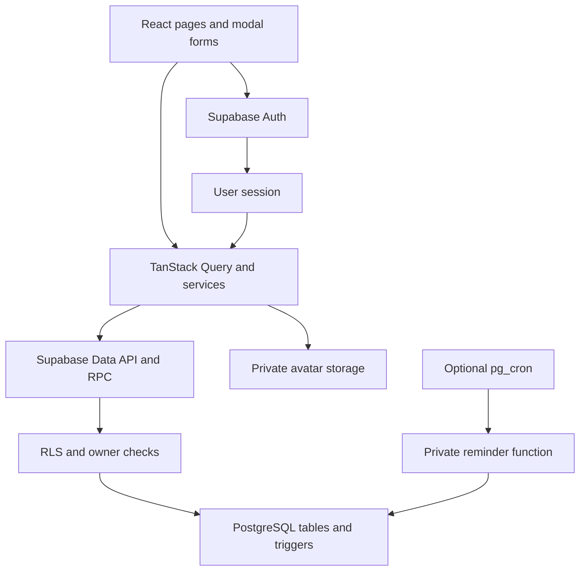
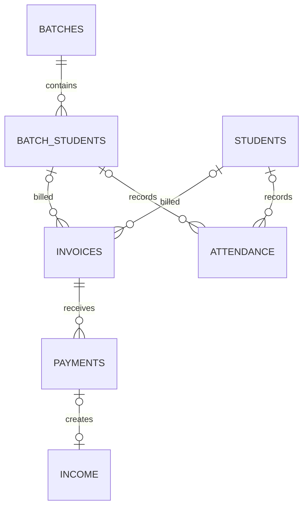

# JPMS architecture and development guide

## Scope and ownership

JPMS v1 is a personal ERP for a student and teacher. Each Supabase Auth user owns a separate personal workspace. A private student and a batch enrolment are distinct teaching relationships. This keeps the first version understandable while supporting multiple accounts with database-enforced isolation.

The application is a client-rendered React SPA deployed to Vercel. Supabase provides authentication, a PostgreSQL API, database functions and private file storage. There is no separate Node API server to deploy. Operations needing elevated rights live in narrowly scoped PostgreSQL functions/triggers, never in the frontend.

## Why these choices

| Choice                          | Reason and tradeoff                                                                                                                             |
| ------------------------------- | ----------------------------------------------------------------------------------------------------------------------------------------------- |
| React + Vite SPA                | Fast local development and simple static deployment; the same DOM UI can be packaged with Capacitor                                             |
| Feature folders                 | Teaching, finance, tasks and loans can evolve without turning a single page into the whole application                                          |
| JavaScript/JSX                  | Matches the requested React JS stack; validation and SQL constraints provide explicit boundaries. TypeScript can be adopted incrementally later |
| Tailwind v4 + shared CSS tokens | Utility styling and consistent light/dark surfaces, spacing, typography and responsive layouts                                                  |
| React Hook Form                 | Central input validation, submit state and reusable fields; SQL independently enforces constraints                                              |
| TanStack Query                  | User-scoped server cache, retries, refetch, cancellation and mutation invalidation without duplicating server data in global state              |
| Supabase RLS                    | Ownership checks remain active for direct API requests and native clients                                                                       |
| Invoice snapshots               | Current student fees cannot silently rewrite past dues                                                                                          |
| Receipt-to-income trigger       | A payment and its cash income change in the same transaction, avoiding UI-created duplicates                                                    |
| Loan repayments table           | Partial payments are auditable records; generated settlement cannot be manually forged                                                          |
| Archive paid students           | Financial history is retained; removing unpaid students remains possible through a constrained RPC                                              |
| Optional pg_cron                | Database inbox reminders can be generated while clients are closed without a separate scheduler service                                         |
| Capacitor                       | Reuses this web interface; React Native would require rebuilding UI components despite reusing business concepts/services                       |

## Data model

The executable source of truth is [001_jpms.sql](../supabase/migrations/001_jpms.sql). It includes exact types, defaults, lengths, checks, keys, policies, triggers, grants and indexes. UUID primary keys are used throughout. All business rows carry `user_id`; child references use composite keys including the owner.

| Table            | Main fields and purpose                                                                                                      |
| ---------------- | ---------------------------------------------------------------------------------------------------------------------------- |
| `users`          | Auth user ID, name, email, phone, profile_image, theme, timezone, created_at; email is Auth-managed                          |
| `income`         | User, title, category, amount, date, description, optional unique payment_id, created_at                                     |
| `expense`        | User, title, category, amount, date, description, created_at                                                                 |
| `students`       | User, name, phone, guardian_name, address, class, subject, monthly_fee, joining_date, active, schedule_days/time, created_at |
| `batches`        | User, batch_name, class, subject, schedule text, structured schedule_days/time, active, created_at                           |
| `batch_students` | User, batch_id, student_name, phone, guardian_name, address, monthly_fee, joining_date, active, created_at                   |
| `attendance`     | User, either student_id or batch_student_id, date, status, note, created_at; unique student/day                              |
| `invoices`       | User, either student or enrolment, title snapshot, month, amount, due_date, created_at; unique student/month                 |
| `payments`       | User, invoice_id, derived student/enrolment/month, amount, payment_date, status, note, created_at                            |
| `tasks`          | User, title, description, date, priority, status, reminder_at, created_at                                                    |
| `loans`          | User, person_name, phone, amount, type, date, due_date, note, repaid_amount, generated status, created_at                    |
| `loan_payments`  | User, loan_id, amount, date, note, created_at                                                                                |
| `notifications`  | User, kind, source_id, dedupe_key, title, body, internal link, read_at, created_at                                           |

An attendance/invoice row references **exactly one** of a private student or a batch enrolment. Payment status describes a recorded receipt; the displayed invoice status (unpaid/partial/paid) is derived from its balance.

The optional ends above express the two possible student types and manual income. SQL imposes the stronger rule: every receipt creates exactly one linked income row; manual income has no receipt. Loans have one-to-many repayment rows. Every table in the diagram is independently owned by a profile, as are tasks, expenses, loans and notifications.

## Security and integrity

- Anonymous users have no access to business tables or public mutation RPCs. Each authenticated request must pass `auth.uid()` ownership policies.
- The frontend additionally filters `user_id`; the database policies are the actual access-control boundary.
- Composite foreign keys prevent a caller from attaching their row to another user's student, invoice, batch or loan.
- Auth profile creation and email synchronization use database triggers. Profile updates are restricted to editable columns. Passwords are never stored in the public schema.
- Invoices are readable through the API and created through a user-scoped RPC. Receipt-linked income cannot be directly inserted/edited/deleted by ordinary clients.
- Receipt writes lock their parent invoice, check aggregate payments, and reject overpayment. Repayment writes similarly lock the loan and reject excess repayment. A failed transaction rolls back its side effects.
- Loan outstanding state is computed from repayments. Type/date changes are restricted after repayments exist. Principal cannot fall below the repaid amount.
- Financial foreign keys defer their final check until transaction end. This allows privileged account removal to cascade completely while preventing isolated history-breaking deletes.
- `private` functions have fixed search paths and restricted execution. Exposed functions derive the current owner from the authenticated session.
- Avatar files are private, owner-folder scoped and limited to 2 MiB JPEG/PNG/WebP. The app requests short-lived signed URLs.
- Form fields are whitelisted before writes. Creates retain one UUID while the form stays open, so retrying a lost create response can find the existing row. Closing the form and creating a new receipt is a new submission; check history before manually retrying.
- User data is escaped by React rendering; CSV cells escape quotes/newlines and neutralize spreadsheet formulas in text fields.

The included tests exercise these rules in embedded PostgreSQL. Hosted API grants, Auth email links, signed URLs and concurrent-client behaviour still require the acceptance checks in [TESTING.md](TESTING.md).

## Data fetching and state

`useWorkspace` requests one user-scoped snapshot. The service refreshes reminders/current-month invoices, then loads 12 tables in 500-row pages ordered by ID. It refreshes every minute and on window focus; successful mutations invalidate that user's workspace query. `AuthProvider` owns identity, profile and password-recovery state. Logout clears queries. Local component state holds filters and modals.

This design avoids a 1,000-row truncation bug and keeps reports/backup complete for normal personal use. It still loads all historical records, and independent table requests are not a single MVCC snapshot. API max rows must be at least 500. At commercial scale, replace full snapshots with per-module server pagination, SQL reporting RPCs, stable snapshot exports and optional Realtime subscriptions. Keep the ownership and accounting constraints.

Business records are not written to localStorage. The Supabase session and device preferences are persisted locally. The app requires a network connection; there is no offline queue, service worker or background synchronization.

## Folder structure

| Path                         | Responsibility                                                                         |
| ---------------------------- | -------------------------------------------------------------------------------------- |
| `src/main.jsx`               | React root and shared providers                                                        |
| `src/App.jsx`                | Router, lazy feature imports, configuration gate                                       |
| `src/components/ui.jsx`      | Buttons, inputs, cards, tables, modal forms, confirmations, loading/error/empty states |
| `src/layouts/AppLayout.jsx`  | Auth guard, sidebar, top bar, mobile navigation and page outlet                        |
| `src/pages`                  | Setup and not-found pages                                                              |
| `src/features/auth`          | Auth context, registration/login/recovery and native link handling                     |
| `src/features/dashboard`     | KPIs and charts                                                                        |
| `src/features/finance`       | Income/expense management and report filters                                           |
| `src/features/teaching`      | Private students, batches, shared billing and attendance components                    |
| `src/features/tasks`         | Task management                                                                        |
| `src/features/loans`         | Loans and repayment history                                                            |
| `src/features/notifications` | Reminder inbox and browser permission flow                                             |
| `src/features/settings`      | Profile, avatar, appearance, backup/export and password change                         |
| `src/hooks`                  | Query mutations and theme state                                                        |
| `src/services`               | Supabase operations, export/download adapters                                          |
| `src/lib`                    | Supabase and QueryClient configuration                                                 |
| `src/utils`                  | Money, date, category, balance and CSV functions                                       |
| `src/styles.css`             | Tailwind entry, tokens and reusable responsive styles                                  |
| `supabase/migrations`        | Versioned database source                                                              |
| `supabase/optional_cron.sql` | Optional scheduled inbox generation                                                    |
| `scripts`                    | Reviewable backup-to-SQL converter                                                     |
| `tests`                      | Domain and PostgreSQL integration tests                                                |
| `docs`                       | Architecture, setup-adjacent guides and validation scope                               |
| `public`                     | App icon and web manifest metadata                                                     |

## UI wireframe idea

Design language: calm neutral surfaces, green primary actions, restrained borders, readable finance numbers, consistent rounded cards. Light/dark tokens share the same component structure.

| Screen zone      | Desktop                                                            | Mobile                                                          |
| ---------------- | ------------------------------------------------------------------ | --------------------------------------------------------------- |
| Navigation       | Persistent left sidebar with module names                          | Drawer for all modules; bottom shortcuts for frequent pages     |
| Top bar          | Page context, theme toggle, reminder count and profile             | Compact controls with drawer trigger                            |
| Dashboard header | Greeting, month selector and quick actions                         | Wrapping controls with full-width content                       |
| KPI region       | Multi-column card grid and focus summary                           | Two-column cards or stacked cards on narrow screens             |
| Charts           | Income/expense trend plus category charts                          | Stacked charts with responsive containers                       |
| Work lists       | Tasks and pending collections beside each other where space allows | Stacked lists with touch-sized actions                          |
| Records          | Filter toolbar, table, row actions                                 | Wrapping filters, horizontal table scroll contained in the card |
| Edit/create      | Focus-trapped centered modal                                       | Width-constrained modal with internal scrolling                 |
| Feedback         | Loading skeleton, contextual empty state, retry/error and toast    | Same states with readable touch layout                          |

Routes are `/`, `/finance`, `/tuition`, `/tuition/:id`, `/batches`, `/batches/:id`, `/tasks`, `/loans`, `/notifications`, `/settings`, plus public auth routes. Browser history refresh is supported by the Vercel SPA rewrite.

## Development roadmap

| Stage                | Included implementation                                           | Next verification/evolution                                                                                        |
| -------------------- | ----------------------------------------------------------------- | ------------------------------------------------------------------------------------------------------------------ |
| 1. Foundation        | React/Tailwind shell, router, forms, query layer, error handling  | Browser/device accessibility and visual checks                                                                     |
| 2. Identity/database | SQL tables, relationships, indexes, RLS, Auth and private Storage | Apply migration to own hosted project; verify two accounts and email delivery                                      |
| 3. Finance           | Manual records, cash reports, CSV                                 | Verify own real balances and report periods                                                                        |
| 4. Teaching          | Tuition/batches, attendance, invoice snapshots and receipts       | Verify monthly process and class schedules                                                                         |
| 5. Productivity      | Tasks, loans/repayments and persisted reminders                   | Enable optional cron if desired                                                                                    |
| 6. Personal release  | Profile/themes, backups, Vercel configuration and guides          | Deploy and run documented acceptance cases                                                                         |
| 7. Android           | Capacitor config, native auth adapter, native exports             | Generate native project, device tests, signed release                                                              |
| 8. SaaS expansion    | Ownership boundaries and feature modules provide a base           | Organisations/memberships/RBAC, subscription entitlements, audit trail, pagination, monitoring and support tooling |

Future team support should introduce explicit workspaces and membership roles; do not turn `user_id` into a shared account. Billing entitlements and administrator operations should be checked on the server. A commercial release also needs operational backup/restore drills, dependency updates, abuse controls and measured performance on representative datasets.
